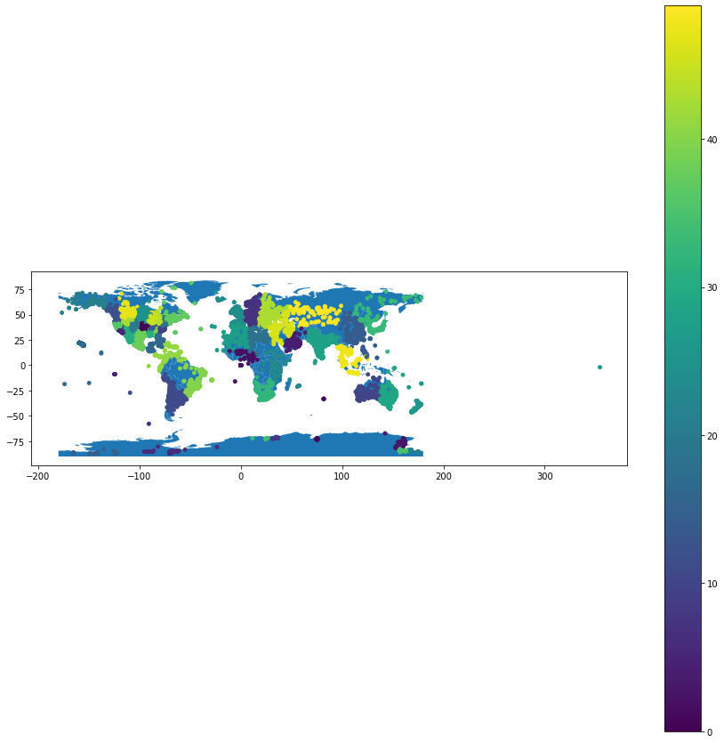

# meteorites-and-UFOs
> Clusters and plots the locations of meteorite landings and UFO sightings across the globe. 

## Table of Contents
* [General Info](#general-information)
* [Technologies Used](#technologies-used)
* [Screenshots](#screenshots)
* [Setup](#setup)
* [Usage](#usage)
* [Project Status](#project-status)
* [Room for Improvement](#room-for-improvement)
* [Acknowledgements](#acknowledgements)
* [Contact](#contact)

## General Information
Plots the locations of meteorite landings and UFO sightings in order to determine if there is a relationship between the location of meteorite landings and UFO sightings. This RDB could and will be designed to be used by people interested in researching locations with clusters of meteorite landings or UFO sightings, as well as the potential relationship between the two. 

## Technologies Used
- AWS
- scikit-learn
- pandas
- matplotlib
- numpy
- shapely
- geopandas
- psycopg2

## Screenshots

## Setup
Ensure the neccessary libraries and datasets have been installed prior to execution and that a valid connection to AWS RDS host has been established.

## Usage
Run all the cells present in meteorites_and_UFOs.ipynb.

## Project Status
Project is: _complete_

## Room for Improvement
Differentiation between meteorite landings and UFO sightings by color on the plot of the world map may allow one to better determine if there is a relationship between the location of meteorite landings and UFO sightings.

## Acknowledgements
- This project was completed as part of coursework for ISTA 322 - Data Engineering at the University of Arizona.

## Contact
Created by [@KiranSmelser](https://github.com/KiranSmelser) - please feel free to reach out and contact me!
